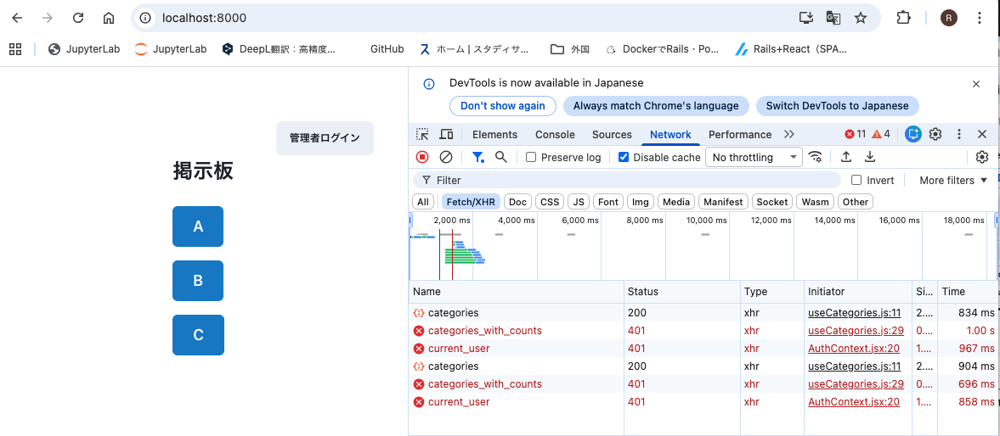
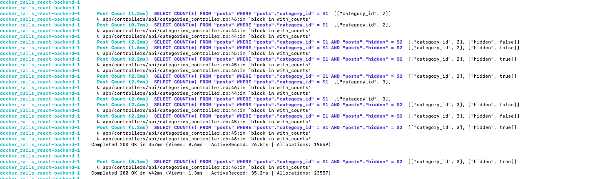

# テスト仕様書

---

## 事象1  
### `/api/posts/admin_index` が誰でもアクセスできてしまう

### ■ 修正前エビデンス（Before）

---

### ■ 対応内容  
- `/api/posts/admin_index` を **管理者以外アクセス禁止** とするように修正した。

---

### ■ 手順 & 結果

#### ① 一般ユーザー（非管理者）としてアクセス  
- アクセス先：  
  `http://localhost:3000/api/posts/admin_index?category_id=1`

- **期待結果**：401 エラー  
- **結果**：OK（期待どおり）

#### ■ 修正後エビデンス（After：一般ユーザー）

---

#### ② 管理者としてアクセス  
- アクセス先：  
  `http://localhost:3000/api/posts/admin_index?category_id=1`

- **期待結果**：200 OK  
- **結果**：OK（期待どおり）

---

---

## 事象2  
### useCategories がどの画面でも `/api/categories_with_counts` を呼んでしまう

### ■ 修正前エビデンス（Before）

---

### ■ 対応内容  
- `useCategories` のロジックを  
  **「管理画面専用 hook useAdminCategories」** と  
  **「一般画面用 hook useCategories」**  
  に分離。  
- 一般ユーザーが `categories_with_counts` を呼ばないよう処理を修正。

---

### ■ 手順 & 結果

#### ① 一般ユーザー（非管理者）として TOP 画面を開く  
- **期待結果**：`/api/categories_with_counts` を呼ばない  
- **結果**：OK（期待どおり）

#### ■ 修正後エビデンス（After：一般ユーザー）

---

#### ② 管理者として投稿管理画面を開き、Networkタブで確認  
- **期待結果**：`/api/categories_with_counts` が呼ばれる  
- **結果**：OK（期待どおり）

---

---

## 事象3  
### with_counts メソッドがカテゴリごとに2回ずつクエリを発行 

### ■ 修正前エビデンス（Before）

---

### ■ 対応内容  
- `JOIN + GROUP BY` に書き換え、  
  **カテゴリ数に関係なく 1 クエリで集計** できるよう修正。

---

### ■ 手順 & 結果

#### ① `/api/categories_with_counts` を実行し、Railsログを確認  
- **期待結果**：クエリが 1 回で完了している  
- **結果**：OK（期待どおり）

#### ■ 修正後エビデンス（After：SQLログ）

---

